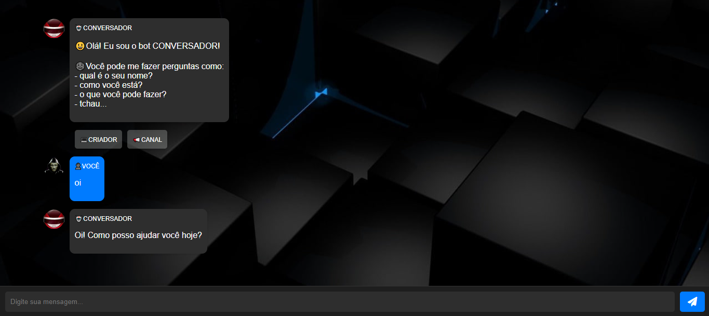

# CONVERSADOR NA WEB
👨‍🏫CHATBOT DE PAPO SIMPLES PARA WEB.

  

## DESCRIÇÃO:
O bot é um chatbot simples que oferece respostas automáticas sobre 50 assuntos comuns do dia a dia. 

Este bot é uma demonstração prática de como implementar um chatbot simples com JavaScript para responder automaticamente a perguntas sobre uma variedade de tópicos cotidianos.

## FUNCIONALIDADES:
1. **Respostas Automáticas**: O bot responde a mensagens com base em palavras-chave sobre 50 tópicos comuns do dia a dia, como tempo, notícias, esportes, comida, filmes, música, educação, entre outros.

2. **Tema Escuro**: A interface do chat possui um tema escuro, tornando-a mais agradável para visualização em ambientes com pouca luz.

3. **Interação Simples**: O usuário digita uma mensagem no campo de entrada e clica em "Enviar". Após um breve intervalo, o bot responde automaticamente com uma mensagem relevante ao tópico mencionado.

4. **Interface Visual**: Utiliza HTML, CSS e JavaScript para criar uma interface de chat responsiva e intuitiva, mostrando as mensagens dos usuários e do bot.

## EXECUTANDO O PROJETO:
1. **Inicialização**:
   - Abra o arquivo `./CODIGO/index.html` no navegador de sua preferencia.

2. **Envio de Mensagem**:
   - Digite uma mensagem no campo de entrada e clica no botão "ENVIAR".
   - O bot responderá automaticamente com uma mensagem sobre um dos 50 tópicos comuns.
   - Continue a conversa digitando novas mensagens e recebendo respostas automáticas do bot.

3. **Processamento**:
   - A mensagem do usuário é exibida no chat como "USUARIO".
   - O bot processa a mensagem após um breve intervalo e envia uma resposta como "ROBÔ" com base nas palavras-chave definidas em `RESPOSTAS.js`.

4. **Exemplos de Uso**:
   - Digitar "tempo" para receber informações sobre o clima.
   - Enviar "música" para discutir sobre diferentes gêneros musicais.
   - Explorar outros tópicos como comida, filmes, saúde, tecnologia, entre outros, para obter respostas correspondentes do bot.

## NÃO SABE?
- Entendemos que para manipular arquivos em `HTML`, `CSS` e outras linguagens relacionadas, é necessário possuir conhecimento nessas áreas. Para auxiliar nesse aprendizado, oferecemos cursos gratuitos disponíveis:
* [CURSO DE HTML E CSS](https://github.com/VILHALVA/CURSO-DE-HTML-E-CSS)
* [CURSO DE JAVASCRIPT](https://github.com/VILHALVA/CURSO-DE-JAVASCRIPT)
* [CURSO DE JQUERY](https://github.com/VILHALVA/CURSO-DE-JQUERY)
* [CONFIRA MAIS CURSOS](https://github.com/VILHALVA?tab=repositories&q=+topic:CURSO)

## CREDITOS:
- [PROJETO CRIADO PELO VILHALVA](https://github.com/VILHALVA)
